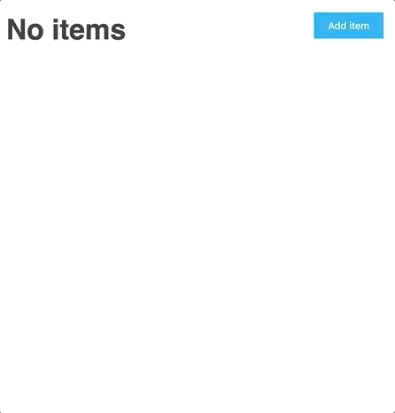

# Vanilla Redux

Let's use vanilla JavaScript [redux](https://www.npmjs.com/package/redux) to create a simple application.

The application should display a list of items.

If there are no items yet - display a message saying there are no items.

Add an item every 2 seconds, but only if there are less than 5 items.
Once there are 5 items or more, stop adding items automatically.

Subscribe to the store to know when new items are added.

The application should also display a button. On click on the button, add a new item.

After the count of items has reached 10, unsubscribe from the store, and remove the click listener on the button.

Display a counter that shows the number of items in the list. If there are no items yet, do not display the counter.

Use [faker](https://www.npmjs.com/package/faker) to generate random strings.

Use a separate file for the store, a separate file for the reducer, and a separate file for the UI changes.
